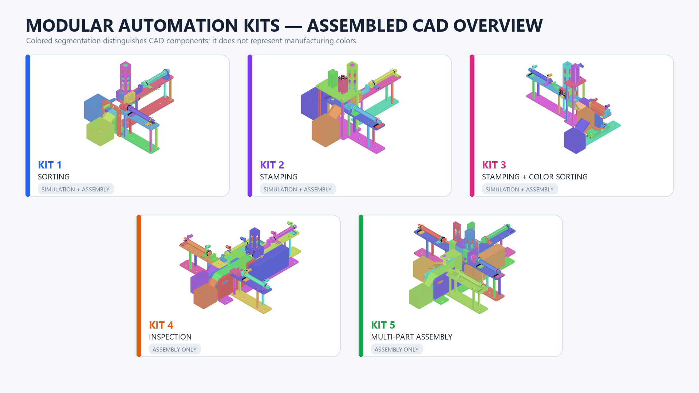
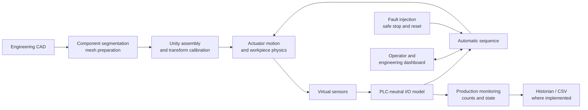
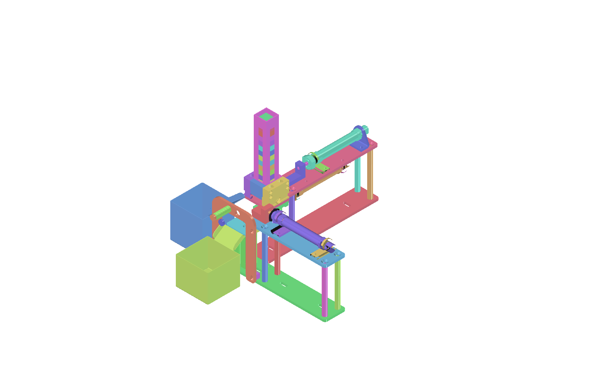
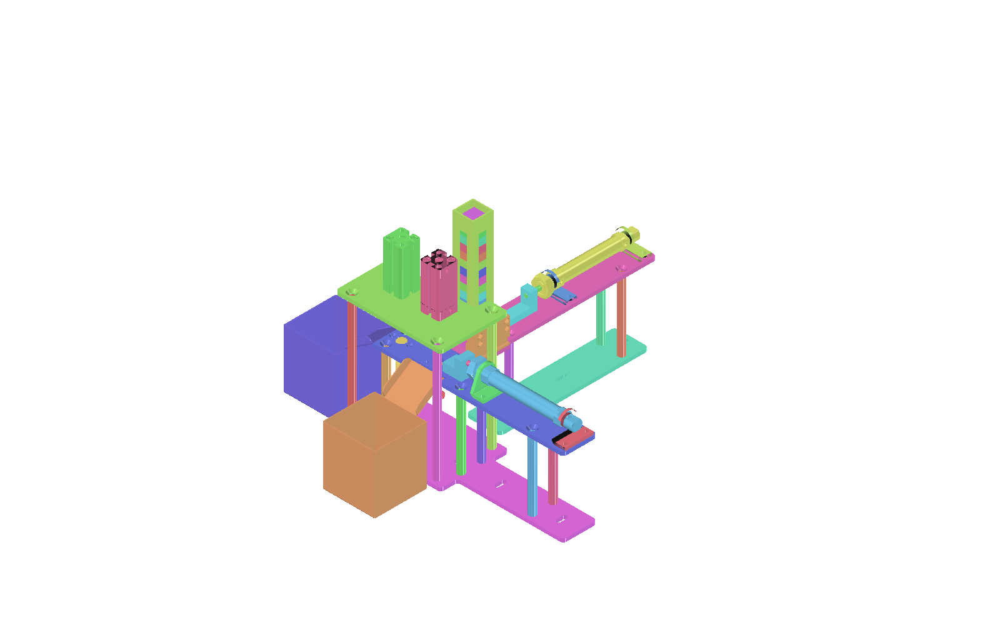
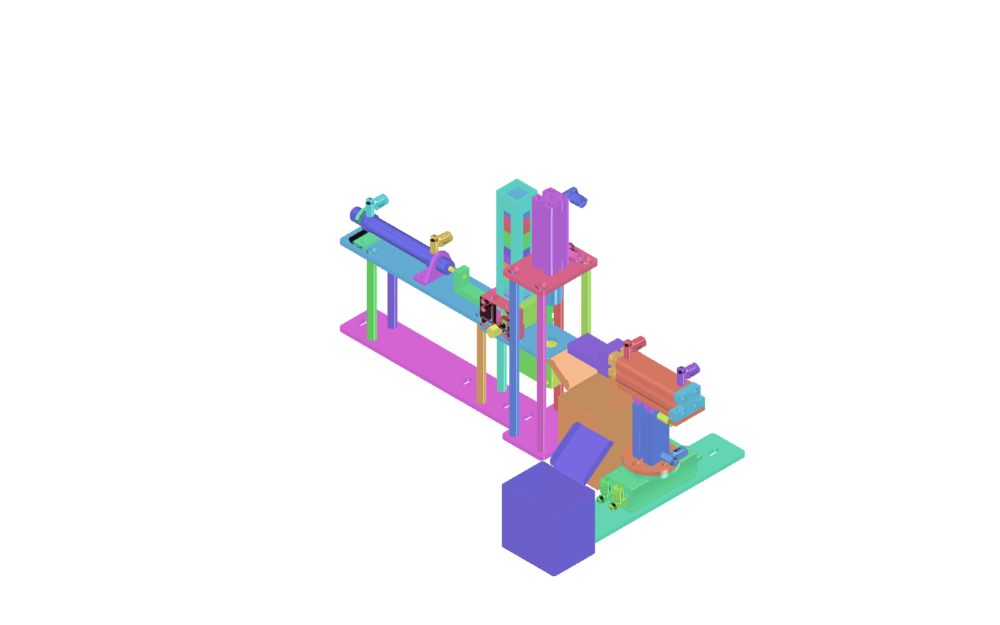
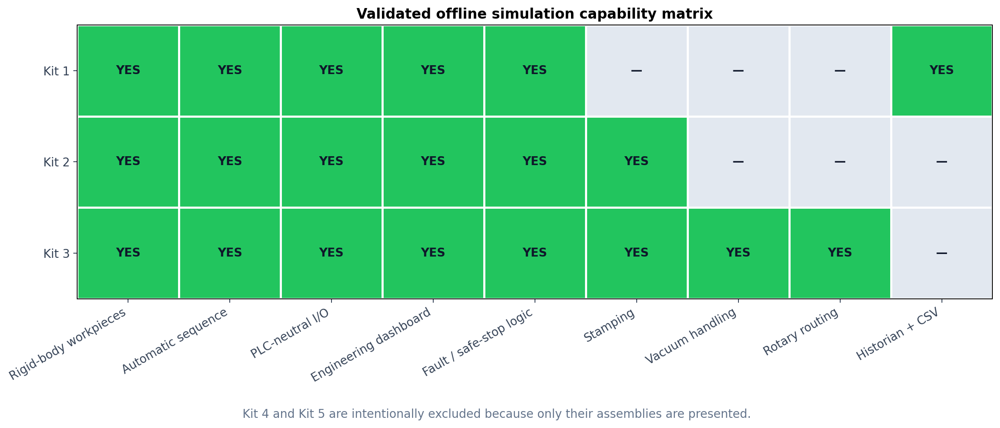
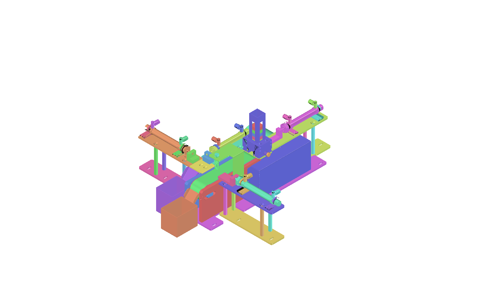
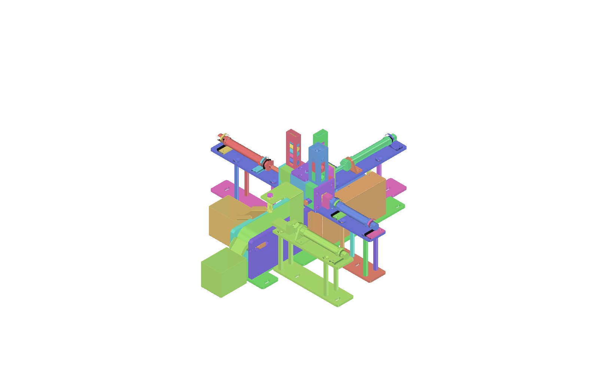
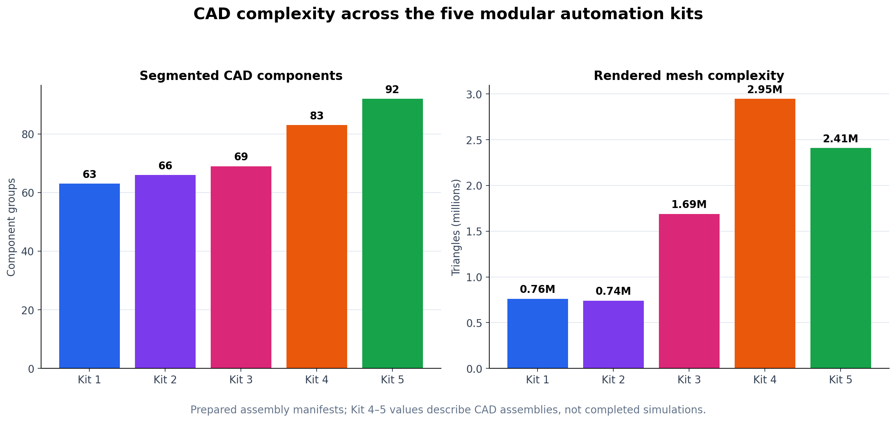
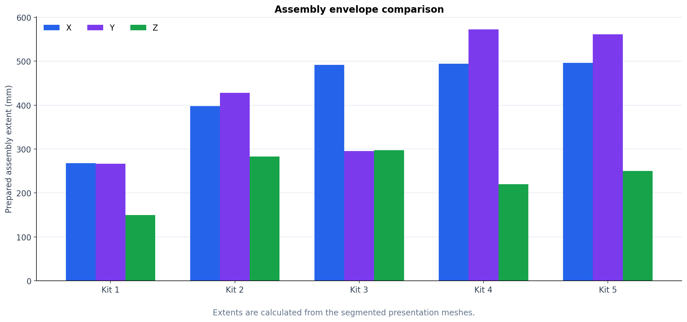

# Modular Automation Kits — Presentation Context

## Scope and claim boundary

This package presents five modular automation-kit assemblies and the completed offline digital-twin work for Kits 1–3.

- **Kits 1–3:** assembled CAD, interactive Unity simulation, automatic sequences, workpiece physics, sensors, PLC-neutral I/O, and engineering dashboards.
- **Kits 4–5:** assembled CAD and intended module purpose only. Their simulations are deliberately excluded and no simulation-completion claim is made.
- Colored CAD segmentation is used to distinguish components visually. The colors are **not** intended to reproduce manufacturing colors or material finishes.
- “Assembly extent” means the bounding dimensions of the prepared presentation mesh, not a certified machine footprint.

## Working-machine videos

The three MP4 clips are clean 1280 × 720, 24 fps captures rendered directly from the Unity game cameras. They contain no editor chrome and can be inserted directly into PowerPoint.

- [Kit 1 — sorting demonstration](videos/kit-1-sorting-demo.mp4) — 18 seconds
- [Kit 2 — stamping demonstration](videos/kit-2-stamping-demo.mp4) — 20 seconds
- [Kit 3 — vacuum and color-sorting demonstration](videos/kit-3-vacuum-sorting-demo.mp4) — 22 seconds

For a live presentation, set each video to start automatically when its slide appears. The clips intentionally show several automatic cycles rather than the entire 16-workpiece batch.

## One-slide project summary

**Title:** Offline Digital Twins for Modular Industrial Automation Training Kits

**Core message:**

Five industrial training assemblies were converted from engineering CAD into presentation-ready segmented models. Kits 1–3 were developed further into interactive Unity digital twins with actuator motion, rigid-body workpieces, sensors, automatic sequences, commissioning controls, PLC-neutral I/O, monitoring, and fault handling. Kits 4–5 are included as completed assembly visualizations and future digital-twin candidates.

**Presentation takeaway:**

The work demonstrates a repeatable CAD-to-simulation pipeline: preserve the mechanical assembly, isolate moving components, add physics and control logic, verify the production sequence, and expose the system through an operator/engineering interface.

## Recommended PowerPoint structure

| Slide | Suggested title | Main visual | Main point |
|---:|---|---|---|
| 1 | Modular Automation Digital Twins | Five-kit overview | Introduce the project and scope |
| 2 | CAD-to-Digital-Twin Workflow | Architecture diagram below | Explain the development method |
| 3 | Kit 1 — Sorting Module | Kit 1 colored assembly | Sorting, sensing, physics, and logging |
| 4 | Kit 1 — Validated Process | Short sequence diagram or simulation screenshot | Show feed, classify, route, count |
| 5 | Kit 2 — Stamping Module | Kit 2 colored assembly | Material-dependent stamping routes |
| 6 | Kit 3 — Stamping and Color Sorting | Kit 3 colored assembly | Vacuum pickup and rotary bin routing |
| 7 | Simulation Capability Comparison | Capability matrix plot | Compare validated functions in Kits 1–3 |
| 8 | Engineering Scale of the CAD | CAD complexity plot | Show segmentation and rendering workload |
| 9 | Kit 4 — Inspection Assembly | Kit 4 colored assembly | Load-cell and conveyor inspection concept |
| 10 | Kit 5 — Multi-Part Assembly | Kit 5 colored assembly | Multi-feeder sequential assembly concept |
| 11 | Validation, Boundaries, and Future Work | Assembly-envelope plot or checklist | State what is verified and what remains |
| 12 | Conclusion | Five-kit overview | Reiterate the reusable digital-twin pipeline |

## System overview

| Kit | Module | Prepared CAD groups | Rendered triangles | Prepared mesh extent X × Y × Z | Presentation status |
|---|---|---:|---:|---:|---|
| 1 | Sorting | 63 | 760,480 | 268.0 × 266.5 × 150.0 mm | Validated offline simulation + assembly |
| 2 | Stamping | 66 | 740,031 | 397.8 × 428.0 × 283.0 mm | Validated offline simulation + assembly |
| 3 | Stamping and color sorting | 69 | 1,688,481 | 491.6 × 295.4 × 297.5 mm | Validated offline simulation + assembly |
| 4 | Inspection | 83 | 2,947,149 | 494.5 × 572.5 × 220.0 mm | Assembly only in this presentation |
| 5 | Multi-part assembly | 92 | 2,409,332 | 496.5 × 561.2 × 250.0 mm | Assembly only in this presentation |

The component-group counts come from the prepared CAD manifests. Triangle counts describe the presentation meshes and indicate rendering complexity, not mechanical performance.

## CAD-to-digital-twin architecture

**Speaker note:** The key engineering step was not merely importing CAD. Each useful mechanism had to be isolated, given a stable pivot and motion axis, connected to a sensor/I/O model, and then verified as part of a production sequence.

---

# Kit 1 — Sorting Module

**Working video:** [Play or download the Kit 1 sorting demonstration](videos/kit-1-sorting-demo.mp4)

## Purpose

Kit 1 demonstrates automated classification and sorting of mixed workpieces. It combines pneumatic-style linear motions, virtual sensing, rigid-body workpieces, bin routing, production counting, and an engineering dashboard.

## Validated simulation content

- Four simulated axes: **40 mm feed**, **50 mm lower eject**, **50 mm upper eject**, and **31.2 mm lift**.
- A batch contains **16 workpieces** using blue metal and orange plastic visual classes.
- Sensor logic identifies the workpiece class and selects the correct route.
- Workpieces use gravity and collision physics rather than purely visual teleportation.
- Automatic and manual/commissioning operation are available.
- PLC-neutral digital I/O is exposed so control logic is separated from a specific PLC vendor.
- The engineering dashboard presents machine state, I/O, production information, utilities, and fault controls.
- Historian and CSV export are implemented for recorded operating data.

## Simplified production sequence

1. Confirm the system is ready and the receiving position is clear.
2. Feed one workpiece into the inspection/sorting position.
3. Evaluate the virtual sensor signals and classify the workpiece.
4. Select and actuate the corresponding sorting route.
5. Allow the rigid body to enter the assigned bin.
6. Update production counts and return the actuators to their home states.
7. Repeat until the batch is complete or the sequence is stopped.

## Suggested slide bullets

- Mixed material sorting with virtual industrial sensors
- Physics-based workpiece movement and collision handling
- Four calibrated actuator axes and a 16-piece batch
- Automatic, manual, monitoring, fault, and reset workflows
- PLC-neutral I/O plus historian/CSV output

## Speaker note

Emphasize that the sorting decision is driven by simulated sensor state and sequence logic. The visible motion, I/O, counts, and faults represent the same machine state rather than separate animations.

---

# Kit 2 — Stamping Module

**Working video:** [Play or download the Kit 2 stamping demonstration](videos/kit-2-stamping-demo.mp4)

## Purpose

Kit 2 demonstrates material-dependent routing through two stamping operations. It models feeders, cylinders, independent stamp axes, rigid-body workpieces, sensor decisions, and safe automatic sequencing.

## Validated simulation content

- Four simulated axes: two horizontal cylinder routes and two independent vertical stamp axes.
- Horizontal staging travel is **50 mm** and eject travel is **90 mm**.
- The test batch contains **16 workpieces**, each approximately **25 × 25 × 10 mm**.
- Blue/metal workpieces follow the **Stamp A → Bin 1** route.
- Orange/plastic workpieces follow the **Stamp B → Bin 2** route.
- The simulation supports continuous automatic operation, single-step operation, pause, safe stop, reset, and manual commissioning.
- Validation was accepted on **8 September 2026**.

## Simplified production sequence

1. Release a workpiece from the feeder into the staging position.
2. Detect/classify the workpiece.
3. Move it into the applicable stamping station.
4. Extend the selected stamp, complete the press stroke, and retract safely.
5. Route/eject the processed workpiece toward its assigned bin.
6. Confirm the route is clear before releasing the next piece.
7. Return all moving axes to their home states.

## Suggested slide bullets

- Material-dependent dual stamping paths
- Independent stamping mechanisms with calibrated travel
- Rigid-body workpieces prevent unrealistic overlap during transfer
- Interlocked continuous and step-by-step operation
- Safe-stop, reset, fault handling, and engineering monitoring

## Speaker note

This kit was especially useful for validating sequence interlocks. Feeding, stamping, and ejecting cannot be treated as independent key presses; the next workpiece must remain restrained until the processing location and piston path are clear.

---

# Kit 3 — Stamping and Color Sorting Module

**Working video:** [Play or download the Kit 3 vacuum-sorting demonstration](videos/kit-3-vacuum-sorting-demo.mp4)

## Purpose

Kit 3 combines feeding, stamping, vacuum pickup, linear transfer, rotary routing, and two-bin color sorting. It is the most functionally varied validated simulation in the set.

## Validated simulation content

- Four principal simulated axes: **50 mm feed**, **45 mm stamp**, **50 mm vacuum slide**, and a rotary route from **0° to −90°**.
- The test batch contains **16 workpieces**, each approximately **25 × 25 × 10 mm**.
- Blue workpieces are delivered to **Bin 1**; orange workpieces are rotated and delivered to **Bin 2**.
- Vacuum pickup holds and transfers the rigid-body workpiece through the slide/rotary sequence.
- The automatic cycle keeps the vacuum lift at its calibrated **5 mm approach position**. The extra upper lift is a manual commissioning function, not a required automatic-cycle movement.
- Automatic sequencing, manual commissioning, PLC-neutral I/O, monitoring, and fault handling are included.
- Validation was accepted on **8 September 2026**.

## Simplified production sequence

1. Press the feed cylinder forward and retract it to stage one workpiece.
2. Perform the stamping operation after the workpiece reaches the processing position.
3. Extend the vacuum head horizontally to align the suction cup above the workpiece.
4. Engage vacuum and attach the workpiece at the calibrated pickup height.
5. Retract the vacuum slide while retaining the workpiece.
6. For a blue workpiece, release at the Bin 1 route.
7. For an orange workpiece, rotate the head to the Bin 2 route and release.
8. Return the rotary and linear axes home before the next cycle.

## Suggested slide bullets

- Integrated feed, stamp, vacuum, slide, and rotary mechanisms
- Calibrated suction pickup and physically attached workpiece transfer
- Color-dependent two-bin sorting
- Removal of unnecessary vertical movement from the automatic cycle
- Interlocked return-home behavior before processing the next part

## Speaker note

The major calibration challenge was keeping the suction cup close enough to grip the workpiece without moving below the initialized position or intersecting the platform. The final automatic sequence uses only the required approach height; the larger vertical lift remains available for manual testing.

---

# Kits 1–3 — Validated Capability Comparison

## How to present this plot

- All three simulations share rigid-body workpieces, an automatic sequence, PLC-neutral I/O, engineering dashboards, and fault/safe-stop logic.
- Kit 1 adds historian and CSV data capture.
- Kits 2 and 3 add stamping.
- Kit 3 adds vacuum handling and rotary routing, making it the broadest validated mechanism set.
- Kits 4 and 5 are intentionally absent because this presentation includes their assemblies only.

---

# Kit 4 — Inspection Module

## Intended module purpose

Kit 4 is an inspection module centered on a conveyor and load-cell-based measurement station. Its documented educational scope includes integration of a load cell and analog card/controller, conveyor operation, and VFD-based conveyor-speed control.

## Assembly observations

- Central conveyor path with inspection/measurement hardware.
- Multiple pneumatic-style cylinder assemblies positioned around the transfer path.
- Two receiving bins are present in the CAD assembly.
- The prepared assembly contains **83 segmented component groups**.

## Claim boundary for the slide

Use this assembly image to discuss the intended inspection architecture and future work. Do **not** describe Kit 4 as a completed or validated simulation in this presentation.

## Suggested slide bullets

- Conveyor-based in-line inspection assembly
- Intended load-cell and analog measurement integration
- Intended VFD conveyor-speed control
- Prepared, segmented CAD ready for later mechanism isolation and simulation

---

# Kit 5 — Multi-Part Assembly Module

## Intended module purpose

Kit 5 is a multi-part assembly training module. Its documented concept combines multiple gravity feeders and sequential cylinder operations to assemble components according to part type and support production/material logging.

## Assembly observations

- Multiple feeder towers and transfer cylinders arranged around a shared assembly area.
- Several receiving bins and process routes are visible in the CAD.
- The prepared assembly contains **92 segmented component groups**, the highest count in the five-kit set.
- The colored render was generated from the segmented Kit 5 engineering CAD specifically for this presentation package.

## Claim boundary for the slide

Use this assembly image to explain the intended multi-stage assembly concept and the next phase of digital-twin development. Do **not** describe Kit 5 as a completed or validated simulation.

## Suggested slide bullets

- Multi-feeder, multi-cylinder assembly concept
- Sequential component handling based on part type
- Most component-rich prepared CAD assembly in the set
- Future target: mechanism isolation, sensor mapping, sequence logic, and collision validation

---

# Engineering Plots

## CAD segmentation and rendering complexity

**Slide narration:** Component segmentation increases from 63 groups in Kit 1 to 92 in Kit 5. Rendered triangle count is highest for Kit 4 at approximately 2.95 million. These values show the preparation and rendering workload; they do not measure cycle time or control-system complexity.

## Prepared assembly envelope

**Slide narration:** Kits 4 and 5 occupy the largest prepared mesh envelopes. Kit 3 has the greatest prepared Z extent. These dimensions are computed from the segmented presentation meshes and should not be presented as certified installation footprints.

## Reusable chart data

The data behind both comparison plots is available in [`kit-comparison.csv`](kit-comparison.csv). The charts can be regenerated or restyled with [`generate_plots.py`](generate_plots.py).

For Kits 4–5, zero values in the simulation-axis and batch fields mean **not presented as a validated simulation**, not that the physical assemblies contain no moving mechanisms or workpieces.

---

# Validation and Responsible Claims

## What has been verified

- Kits 1–3 compile and run as offline Unity simulations.
- Their major actuator motions, automatic sequences, workpiece handling, sensor/I/O behavior, dashboards, and reset/fault workflows were exercised during development.
- Kit 2 and Kit 3 have recorded acceptance on 8 September 2026.
- All five assemblies have presentation-ready segmented CAD images.

## What is not claimed

- Physical PLC communication has not been commissioned or tested.
- Final physical PLC addresses remain to be mapped; the current model uses logical PLC-neutral I/O.
- The simulations are engineering/training models, not certified machine-safety controllers.
- XR deployment has not been completed.
- Kit 4 and Kit 5 simulations are not included and should not be implied by the assembly renders.

## Suggested final-slide future work

1. Isolate and calibrate Kit 4 conveyor, cylinder rods, load-cell platform, and sensor targets.
2. Add analog load-cell scaling and a VFD speed-command/feedback model.
3. Isolate Kit 5 feeder gates, cylinders, assembly nests, and collision bodies.
4. Implement Kit 5 recipe-dependent sequencing and material/production logging.
5. Map the PLC-neutral interfaces to the selected physical PLC and verify hardware-in-the-loop behavior.
6. Optimize the higher-triangle assemblies for deployment targets and optional XR use.

---

# Ready-to-use conclusion

The project establishes a reusable workflow for converting complex industrial training-kit CAD into functional offline digital twins. Kits 1–3 demonstrate that the approach can preserve mechanical context while adding calibrated motion, rigid-body handling, sensing, sequence control, dashboards, and fault workflows. Kits 4–5 extend the prepared assembly library and define the next simulation targets: conveyor inspection with analog weighing and multi-stage component assembly.

# Presentation asset index

## Assembly images

- [`all-kits-assembled-overview.png`](images/all-kits-assembled-overview.png)
- [`kit-1-assembled-colored.png`](images/kit-1-assembled-colored.png)
- [`kit-2-assembled-colored.png`](images/kit-2-assembled-colored.png)
- [`kit-3-assembled-colored.png`](images/kit-3-assembled-colored.png)
- [`kit-4-assembled-colored.png`](images/kit-4-assembled-colored.png)
- [`kit-5-assembled-colored.png`](images/kit-5-assembled-colored.png)

## Plots

- [`simulation-capability-matrix.png`](plots/simulation-capability-matrix.png)
- [`cad-complexity.png`](plots/cad-complexity.png)
- [`assembly-envelope.png`](plots/assembly-envelope.png)

## Videos

- [`kit-1-sorting-demo.mp4`](videos/kit-1-sorting-demo.mp4)
- [`kit-2-stamping-demo.mp4`](videos/kit-2-stamping-demo.mp4)
- [`kit-3-vacuum-sorting-demo.mp4`](videos/kit-3-vacuum-sorting-demo.mp4)

## Data and generation files

- [`kit-comparison.csv`](kit-comparison.csv)
- [`generate_plots.py`](generate_plots.py)
- [`create_contact_sheet.py`](create_contact_sheet.py)

# Source basis

This brief was prepared from the project’s CAD component manifests, Unity project README, validation records for Kits 1–3, Kit 3 objective record, and the source training-kit manual extract. No external or internet-based performance claims were added.
