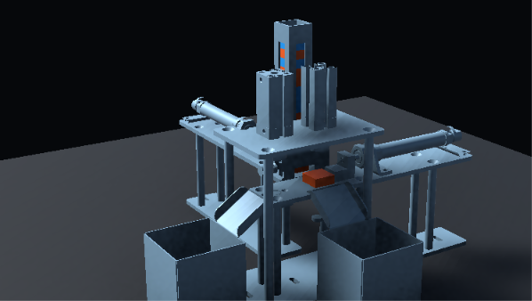
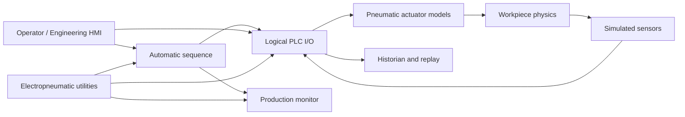

# Pneumatic Sorting Digital Twin

[](https://unity.com/)
[](LICENSE)
[](#project-status)

An open-source Unity digital-twin workspace for modular electropneumatic automation kits. Kits 1–3 provide complete offline sorting, stamping, vacuum-transfer, and material-routing simulations.

The current release runs completely offline. No PLC or XR headset is required.

## Included digital twins

| Module | Purpose | CAD components | Simulated axes | Workpiece process |
|---|---|---:|---:|---|
| **Kit 1** | Metal/plastic sorting | 63 | 4 | Feed → detect → lift → route → bin |
| **Kit 2** | Material-dependent stamping | 66 | 4 | Feed → detect → stamp → eject → bin |
| **Kit 3** | Color stamping and vacuum sorting | 69 | 4 | Feed → stamp → vacuum pick → rotate → bin |

## Kit 1 — pneumatic sorting module


Kit 1 sorts a randomized magazine of blue metal and orange plastic workpieces. The controller feeds one piece onto the lift, evaluates the simulated inductive/capacitive sensors, then selects the correct ejector and bin.

- Four calibrated axes: feed cylinder, lower ejector, upper ejector, and vertical lift
- Physical magazine feed, workpiece transfer, gravity, ramp, and bin collisions
- Automatic mixed-material sequence with manual commissioning controls
- Controller-neutral logical PLC inputs and outputs
- Operator HMI plus seven-tab engineering dashboard
- Production counts, cycle time, alarms, and timestamped events
- 10 Hz historian, CSV export, and local actuator/telemetry replay

- Scene: `Assets/Scenes/Kit1Viewer.unity`
- Validation: [Kit 1 acceptance checklist](Documentation/VALIDATION.md)

## Kit 2 — pneumatic stamping module



Kit 2 models a two-station stamping process with a 16-piece vertical magazine. Each stored piece advances by the measured CAD pitch, becomes an independent rigid body when released, and follows FIFO behavior through the stamping platform and discharge ramps.

- Two horizontal cylinders with separate 50 mm staging and 90 mm eject travel
- Two independently controlled vertical stamp rod/tool pairs
- Inductive and capacitive material detection
- Default recipe: **metal → Stamp A → Bin 1**, **plastic → Stamp B → Bin 2**
- Continuous, step, pause/resume, safe-stop, reset, and unrestricted manual commissioning modes
- Logical PLC I/O, live sensor states, production counters, and engineering diagnostics
- Accurate workpiece-to-workpiece, pusher, platform, ramp, gravity, and bin interaction

- Scene: `Assets/Scenes/Kit2Viewer.unity`
- Validation: [Kit 2 acceptance checklist](Documentation/KIT2_VALIDATION.md)

## Kit 3 — vacuum rotary sorting module

Kit 3 processes a 16-piece blue/orange magazine with a collision-driven 50 mm
feeder, vertical stamp, vacuum slide and lift, and a 0°/-90° rotary bin selector.
It includes continuous and stepped automatic modes, safe homing, logical PLC I/O,
production counts, faults, and a live engineering dashboard.

- Scene: `Assets/Scenes/Kit3Viewer.unity`
- Validation: [Kit 3 acceptance checklist](Documentation/KIT3_VALIDATION.md)

## Shared simulation platform

- 24 VDC control-power and regulated pneumatic-supply simulation
- E-stop, low pressure, air leak, stuck actuator, and failed-sensor injection
- PLC-neutral tags with physical controller addresses intentionally left `TBD`
- Responsive engineering UI, orbit/pan/zoom camera, and component identification
- Automated Unity project validators for all three kits


## Quick start

### Requirements

- Unity Hub
- Unity Editor `6000.6.0f1` (Unity 6.6)
- Git with [Git LFS](https://git-lfs.com/)
- Windows, macOS, or Linux desktop target

### Clone and open

```bash
git lfs install
git clone https://github.com/Galabavamsi/pneumatic-sorting-digital-twin.git
cd pneumatic-sorting-digital-twin
git lfs pull
```

1. Open Unity Hub and select **Add → Add project from disk**.
2. Choose the cloned repository folder.
3. Open it with Unity `6000.6.0f1`.
4. Open the matching viewer scene in `Assets/Scenes`: `Kit1Viewer`, `Kit2Viewer`, or `Kit3Viewer`.
5. Wait for Unity to finish importing and compiling.
6. Select the matching **Tools → Kit 1/Kit 2/Kit 3 Digital Twin → Validate Project** command.
7. Enter Play mode.

For a readable editor preview, use `1280 × 720`, or keep QHD at its fitted Game-view scale. The Unity Game-view **Scale** slider magnifies and crops the whole render; it is not the machine camera zoom.

## Run a simulation

1. Press `F1` to open the engineering dashboard.
2. Confirm **UTILITIES** shows 24 VDC, sufficient pressure, and `READY`.
3. Press `S` to begin the selected kit's automatic batch.
4. Watch the sequence, I/O, production, and diagnostics update live.
5. Press `X` for a safe stop or `M` for a master reset.

Magazine contents are initialized at the beginning of an automatic run. Blue workpieces represent metal; orange workpieces represent plastic.


## Shared controls

| Action | Control |
|---|---|
| Orbit camera | Right-mouse drag |
| Pan workspace | Middle-mouse drag or `Shift` + right-mouse drag |
| Zoom camera | Mouse wheel |
| Fast zoom | `Shift` + mouse wheel |
| Engineering dashboard | `F1` |
| Start automatic batch | `S` |
| Safe stop | `X` |
| Master reset | `M` |
| Previous/next component | `[` / `]` or arrow keys |
| Hide/focus selected component | `H` / `F` |
| Clear component selection | `Esc` |

### Kit 1 controls

| Action | Control |
|---|---|
| Operator HMI | `F2` |
| Expand/collapse operator HMI | `Tab` |
| Select metal/plastic manually | `1` / `2` |
| Feed cylinder extend/retract/toggle | `E` / `R` / `Space` |
| Lower ejector extend/retract/toggle | `T` / `G` / `Y` |
| Upper ejector extend/retract/toggle | `U` / `J` / `I` |
| Lift up/down/toggle | `V` / `C` / `B` |

### Kit 2 controls

| Action | Control |
|---|---|
| Step mode / advance one transition | `N` |
| Pause/resume automatic sequence | `P` |
| Cylinder 1 stage/home/eject | `E` / `R` / `Shift+E` |
| Cylinder 2 stage/home/eject | `T` / `G` / `Shift+T` |
| Stamp A down/up | `U` / `J` |
| Stamp B down/up | `I` / `K` |

Manual actuator controls are available while the automatic sequence is stopped.

### Kit 3 controls

| Action | Control |
|---|---|
| Dashboard show/hide | `F1` |
| Step mode / advance one transition | `N` |
| Pause/resume / safe stop | `P` / `X` |
| Feeder present/retract | `F` / `G` |
| Stamp down/up | `U` / `J` |
| Vacuum toggle | `V` |
| Rotary Bin 1/Bin 2 | `L` / `O` |
| Vacuum slide extend/retract | `E` / `R` |
| Vacuum lift raise/lower | `Q` / `A` |

## Engineering dashboards

Kit 1 provides the full production and historian dashboard:

| Tab | Purpose |
|---|---|
| Overview | Sequence state, material, magazine quantity, and system health |
| I/O | Live logical PLC inputs and outputs |
| Production | Completed, metal, plastic, aborted, cycle-time, and event data |
| Utilities | Voltage, pressure, E-stop, air leak, actuator, and sensor faults |
| History | Record, scrub, replay, export, and clear telemetry sessions |
| Actuators | Position, output command, and reed-switch state for every axis |
| Diagnostics | Alarms, interlocks, runtime state, and engineering controls |

Kit 2 provides a focused commissioning dashboard:

| Tab | Purpose |
|---|---|
| Overview | Sequence, route, remaining pieces, production counts, and automatic controls |
| I/O | Live logical inputs and actuator output commands |
| Utilities | Power, pressure, E-stop, air leak, actuator faults, and sensor faults |
| Diagnostics | Interlock health, sequence faults, timeout status, and PLC integration boundary |

Historian CSV files are written to Unity's persistent application-data directory. On Windows with the default project settings:

```text
%USERPROFILE%\AppData\LocalLow\DefaultCompany\Kit1DigitalTwin\DigitalTwinHistory
```

## Architecture



See [Architecture](Documentation/ARCHITECTURE.md) for component responsibilities and extension points.

## Project status

Kits 1, 2, and 3 are complete offline simulations and PLC-ready software prototypes. Their project validators and Play-mode acceptance checklists pass.

The project does **not** yet connect to physical hardware. Logical tag names intentionally remain independent of controller addresses until the PLC model, program, network, and wiring map are confirmed.

See the [Kit 1 validation record](Documentation/VALIDATION.md), [Kit 2 validation record](Documentation/KIT2_VALIDATION.md), [Kit 3 validation record](Documentation/KIT3_VALIDATION.md), and [roadmap](Documentation/ROADMAP.md).

## Safety

This repository is a simulation and training tool. It is not a safety controller. Do not use Unity, a PC application, or network communications as a replacement for hardwired emergency stops, guards, pressure isolation, or safety-rated PLC functions. Live pneumatic commissioning must be supervised by qualified personnel at the machine.

## Contributing

Issues, documentation improvements, new kit adapters, automated tests, and protocol integrations are welcome. Read [CONTRIBUTING.md](CONTRIBUTING.md) before submitting a pull request.

## License

Released under the [MIT License](LICENSE). Contributors must ensure that CAD, images, and other assets they submit may be redistributed.
