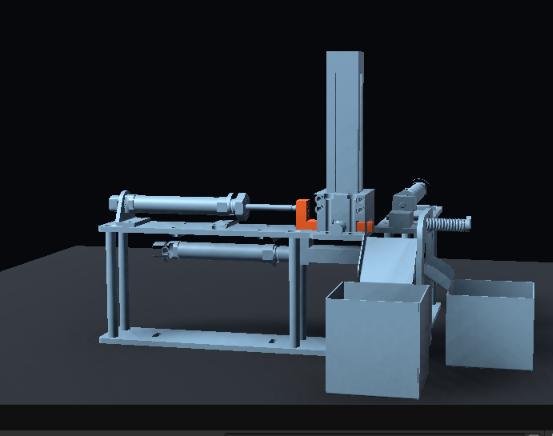
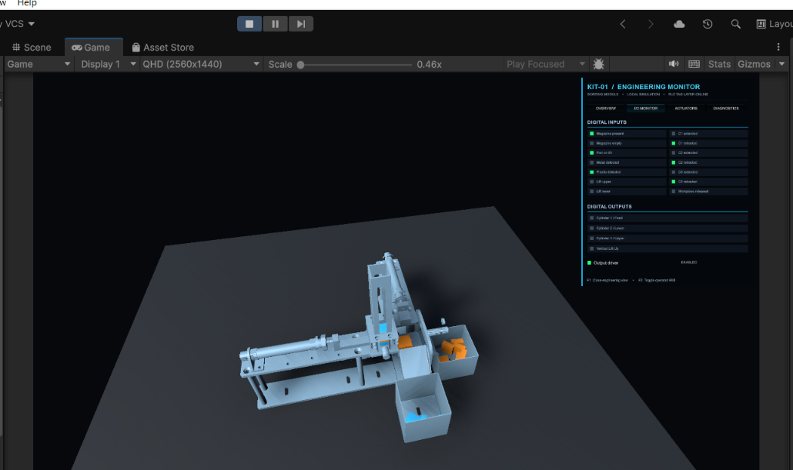
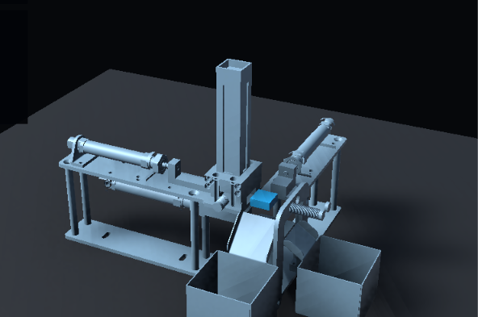
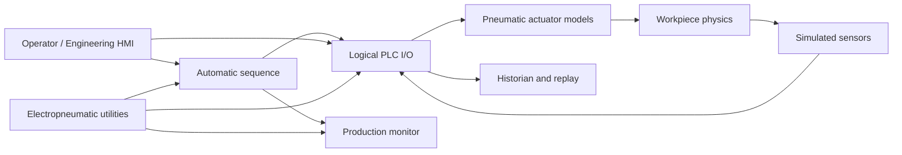

# Pneumatic Sorting Digital Twin

[](https://unity.com/)
[](LICENSE)
[](#project-status)

An open-source Unity digital twin of an electropneumatic sorting station. The project turns segmented CAD geometry into an interactive simulation with pneumatic motion, mixed-material workpieces, PLC-style I/O, engineering HMI, fault injection, production monitoring, and telemetry replay.

The current release runs completely offline. No PLC or XR headset is required.



## What works

- Segmented 63-component CAD assembly imported at engineering scale
- Four calibrated pneumatic axes: feed, lower ejector, upper ejector, and vertical lift
- Automatic mixed-material sorting sequence
- Metal/plastic detection and routing
- Magazine gravity feed and physical workpiece discharge into two bins
- PLC-style logical digital inputs and outputs
- Operator HMI and responsive engineering dashboard
- Production counts, cycle timing, alarms, and timestamped events
- 24 VDC and pneumatic supply simulation
- E-stop, pressure loss, air leak, stuck actuator, and sensor-failure injection
- 10 Hz historian, CSV export, and local actuator/telemetry replay
- Orbit, pan, zoom, and component identification tools



## Quick start

### Requirements

- Unity Hub
- Unity Editor `6000.6.0f1` (Unity 6.6)
- Git with [Git LFS](https://git-lfs.com/)
- Windows, macOS, or Linux desktop target

### Clone and open

```bash
git lfs install
git clone https://github.com/Galabavamsi/pneumatic-sorting-digital-twin.git
cd pneumatic-sorting-digital-twin
git lfs pull
```

1. Open Unity Hub and select **Add → Add project from disk**.
2. Choose the cloned repository folder.
3. Open it with Unity `6000.6.0f1`.
4. Open `Assets/Scenes/Kit1Viewer.unity` if it is not already open.
5. Wait for Unity to finish importing and compiling.
6. Select **Tools → Kit 1 Digital Twin → Validate Project**.
7. Enter Play mode.

For a readable editor preview, use `1280 × 720`, or keep QHD at its fitted Game-view scale. The Unity Game-view **Scale** slider magnifies and crops the whole render; it is not the machine camera zoom.

## Run the simulation

1. Press `F1` to open the engineering dashboard.
2. Confirm **UTILITIES** shows 24 VDC, sufficient pressure, and `READY`.
3. Press `S` to begin automatic sorting.
4. Watch the sequence, I/O, production, and actuator tabs update live.
5. Press `X` for a safe stop or `M` for a master reset.

The magazine contents are randomized at the beginning of an automatic run. Blue workpieces represent metal; orange workpieces represent plastic.



## Controls

| Action | Control |
|---|---|
| Orbit camera | Right-mouse drag |
| Pan workspace | Middle-mouse drag or `Shift` + right-mouse drag |
| Zoom camera | Mouse wheel |
| Fast zoom | `Shift` + mouse wheel |
| Engineering dashboard | `F1` |
| Operator HMI | `F2` |
| Expand/collapse operator HMI | `Tab` |
| Start automatic batch | `S` |
| Safe stop | `X` |
| Master reset | `M` |
| Select metal/plastic manually | `1` / `2` |
| Feed cylinder extend/retract/toggle | `E` / `R` / `Space` |
| Lower ejector extend/retract/toggle | `T` / `G` / `Y` |
| Upper ejector extend/retract/toggle | `U` / `J` / `I` |
| Lift up/down/toggle | `V` / `C` / `B` |
| Previous/next component | `[` / `]` or arrow keys |
| Hide/focus selected component | `H` / `F` |
| Clear component selection | `Esc` |

Manual actuator controls are intended for commissioning tests while the automatic sequence is stopped.

## Engineering dashboard

| Tab | Purpose |
|---|---|
| Overview | Sequence state, material, magazine quantity, and system health |
| I/O | Live logical PLC inputs and outputs |
| Production | Completed, metal, plastic, aborted, cycle-time, and event data |
| Utilities | Voltage, pressure, E-stop, air leak, actuator, and sensor faults |
| History | Record, scrub, replay, export, and clear telemetry sessions |
| Actuators | Position, output command, and reed-switch state for every axis |
| Diagnostics | Alarms, interlocks, runtime state, and engineering controls |

Historian CSV files are written to Unity's persistent application-data directory. On Windows with the default project settings:

```text
%USERPROFILE%\AppData\LocalLow\DefaultCompany\Kit1DigitalTwin\DigitalTwinHistory
```

## Architecture



See [Architecture](Documentation/ARCHITECTURE.md) for component responsibilities and extension points.

## Project status

Kit 1 is an offline simulation and PLC-ready software prototype. It does **not** yet connect to physical hardware. Logical tag names intentionally remain independent of controller addresses until the PLC model, program, network, and wiring map are confirmed.

See the [validation record](Documentation/VALIDATION.md) and [roadmap](Documentation/ROADMAP.md).

## Safety

This repository is a simulation and training tool. It is not a safety controller. Do not use Unity, a PC application, or network communications as a replacement for hardwired emergency stops, guards, pressure isolation, or safety-rated PLC functions. Live pneumatic commissioning must be supervised by qualified personnel at the machine.

## Contributing

Issues, documentation improvements, new kit adapters, automated tests, and protocol integrations are welcome. Read [CONTRIBUTING.md](CONTRIBUTING.md) before submitting a pull request.

## License

Released under the [MIT License](LICENSE). Contributors must ensure that CAD, images, and other assets they submit may be redistributed.
